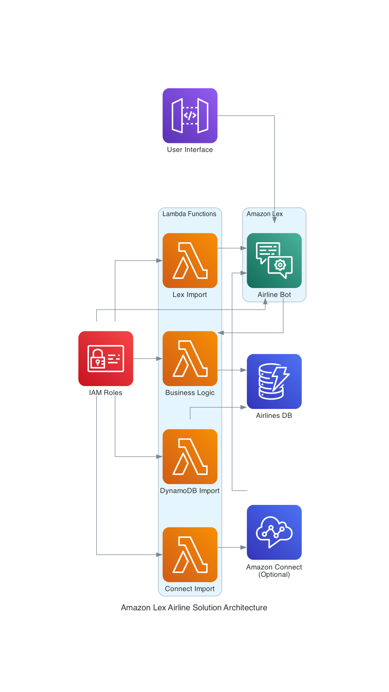

# Amazon Lex Airline Solution

This solution deploys a pre-built Amazon Lex bot for airline travel assistance, providing conversational experiences for both voice and chat modalities.

## Solution Overview

The Amazon Lex Airline Solution creates a complete conversational bot that helps users with airline-related tasks such as booking flights, checking flight status, and managing reservations. The solution includes:

- Amazon Lex bot with pre-built conversation flows
- Lambda functions for business logic and fulfillment
- DynamoDB table for storing sample data
- Optional Amazon Connect integration

## Architecture



The solution consists of the following components:

1. **Amazon Lex Bot**: Provides the natural language understanding and conversation management
2. **Lambda Functions**:
   - Business Logic Function: Handles the core functionality and fulfillment
   - Lex Import Function: Imports the pre-built Lex bot configuration
   - DynamoDB Import Function: Populates the DynamoDB table with sample data
   - Connect Import Function: Sets up Amazon Connect integration (optional)
3. **DynamoDB Table**: Stores sample customer and flight data
4. **IAM Roles**: Provides necessary permissions for the components to interact

## Deployment Options

### CloudFormation Deployment

```bash
aws cloudformation create-stack \
  --stack-name AirlineSolution \
  --template-body file://amazon_lex_airline_solution_fixed.yaml \
  --parameters \
    ParameterKey=BotName,ParameterValue=AirlinesBot \
    ParameterKey=BusinessLogicFunctionName,ParameterValue=AirlinesBusinessLogic \
    ParameterKey=DynamoDBTableName,ParameterValue=Airlines_db \
  --capabilities CAPABILITY_IAM
```

### Bash Script Deployment

```bash
./deploy_airline_solution_fixed.sh
```

## Parameters

| Parameter | Description | Default |
|-----------|-------------|---------|
| BotName | Name of the Lex bot | AirlinesBot |
| BusinessLogicFunctionName | Name of the Lambda function for validation and fulfillment | AirlinesBusinessLogic |
| DynamoDBTableName | Name of the DynamoDB table for sample data | Airlines_db |
| ContactFlowName | Name of the Connect contact flow (optional) | AirlinesContactFlow |
| ConnectInstanceARN | ARN of Connect Instance (optional) | - |

## Testing the Bot

### Using AWS CLI

```bash
aws lexv2-runtime recognize-text \
  --bot-id YOUR_BOT_ID \
  --bot-alias-id YOUR_BOT_ALIAS_ID \
  --locale-id en_US \
  --session-id "test-session" \
  --text "I want to book a flight"
```

### Using Python Script

```python
import boto3
import uuid

# Configure these values
BOT_ID = "YOUR_BOT_ID"
BOT_ALIAS_ID = "YOUR_BOT_ALIAS_ID"

# Initialize Lex client
lex_client = boto3.client('lexv2-runtime')
session_id = str(uuid.uuid4())

# Send a message
response = lex_client.recognize_text(
    botId=BOT_ID,
    botAliasId=BOT_ALIAS_ID,
    localeId='en_US',
    sessionId=session_id,
    text="I want to book a flight"
)

# Print the response
print(response)
```

## Sample Utterances

- "Hello"
- "I want to book a flight"
- "Check my flight status"
- "What's the status of my flight?"
- "I need to change my reservation"

## Cleaning Up

To delete all resources created by this solution:

```bash
# If deployed with CloudFormation
aws cloudformation delete-stack --stack-name AirlineSolution

# If deployed with bash script
./delete_airline_resources.sh
```

## Resources

- [Sample Customer Data](https://lex-usecases-templates.s3.amazonaws.com/AirlinesBot_customer_data.html)
- [Amazon Lex Documentation](https://docs.aws.amazon.com/lex/)
- [AWS Lambda Documentation](https://docs.aws.amazon.com/lambda/)
- [Amazon DynamoDB Documentation](https://docs.aws.amazon.com/dynamodb/)

## License

This solution is licensed under the MIT-0 License. See the LICENSE file.